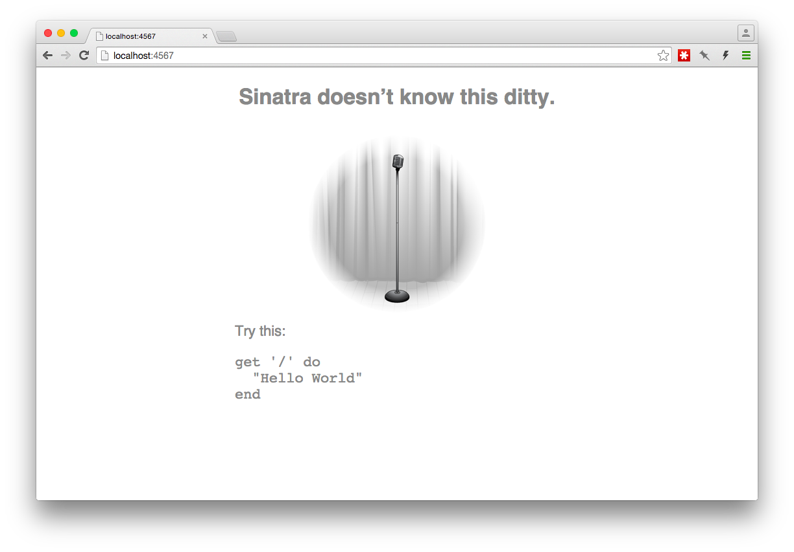
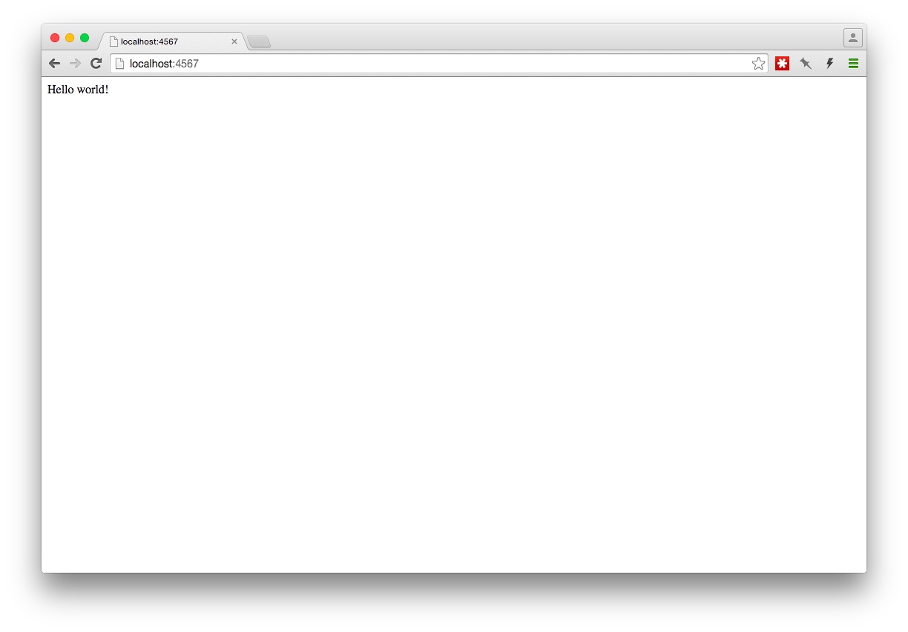
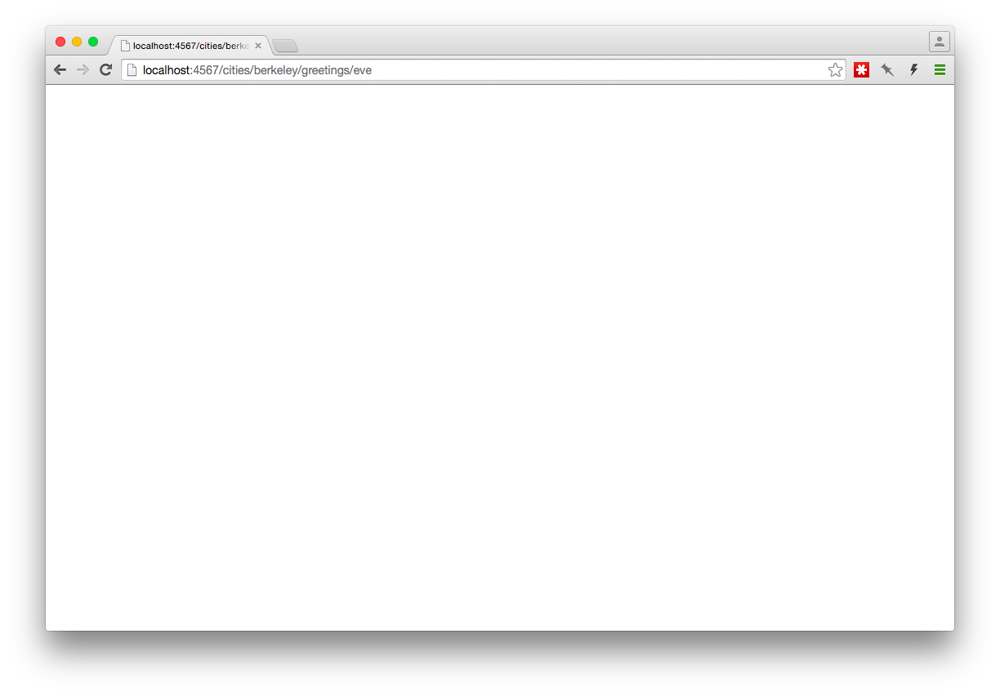
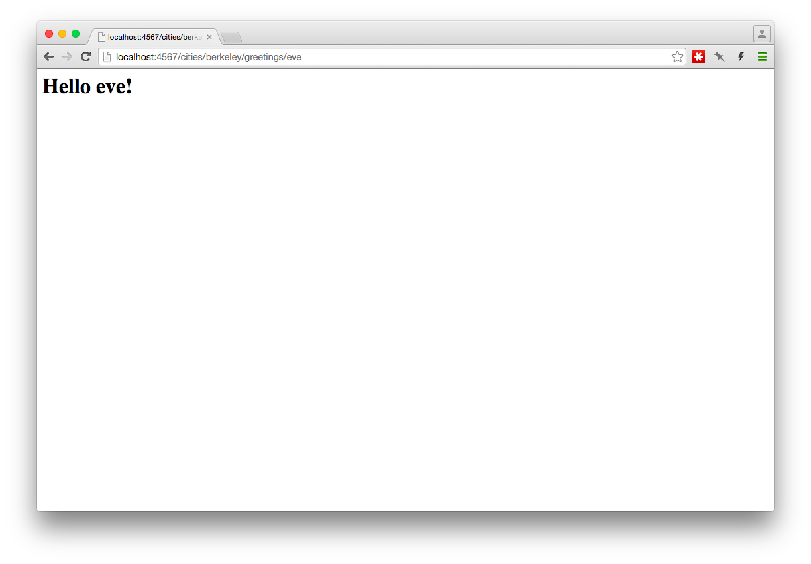

# Snitching on Sinatra

<a href="http://www.sinatrarb.com" target="_blank">Sinatra</a> is a small
Domain-Specific language (or DSL; a "language" that is used for a specific
purpose) for creating web applications quickly.

# The Beginning
If you haven't already, install the sinatra gem:

```bash
$ gem install sinatra -v '~> 1.4.6'
```

*Note: What's with that `~>` syntax? We're telling `gem` to install sinatra 
version greater than or equal to `1.4.6`, but limiting which versions it will 
install to patch releases greater than `1.4.6`. So `1.4.7` might be installed 
in the future, but `1.4.5` won't be. Why `1.4.6`? Sinatra 1.4.5 had a bug that 
prevented sinatra from displaying errors to the browser.*

Create a new ruby file (let's call it `sinatra.rb`, but it could really be
called anything):

```bash
$ touch sinatra.rb
```

and open it in your editor. At the top of this file, we'll need to include the
sinatra library.

```ruby
require 'sinatra'
```

Note that this is simply loading a library, code (ruby in this case) that
defines functionality that a developer might want to use.

# Watching It Fail
Before we code more, let's check out what happens when we just load Sinatra in
our file.  Run your Sinatra application by typing `ruby sinatra.rb` in your
terminal.  Your terminal will respond with something like

```
== Sinatra (v1.4.6) has taken the stage on 4567 for development with backup from Thin
Thin web server (v1.6.2 codename Doc Brown)
Maximum connections set to 1024
Listening on localhost:4567, CTRL+C to stop
```

This tells us some really useful things:
* Sinatra is running on a particular port. We ran `ruby sinatra.rb` without
  specifying a port or a specific web server, so Sinatra automatically runs a
  web server on port `4567`. This will become useful soon.
* Sinatra is using the Thin web server to serve the application.
* We can hit `CTRL+C` at any time to stop the server.

If you'll remember, our application doesn't have anything in it yet. We created
a ruby file and used `require` to load the Sinatra library. When we ran
`sinatra.rb`, Sinatra launched a web server to serve web content on port `4567`.

Open your browser and go to <a href="http://localhost:4567" target="_blank">http://localhost:4567</a>.
What happened?



While you're developing an application, if Sinatra can't find a route it will
respond with a helpful error message. You'll become very familiar with **Sinatra
doesn't know this ditty** (Sinatra's
<a href="https://en.wikipedia.org/wiki/HTTP_404" target="_blank">404 Page</a>
while running locally) as you develop more Sinatra applications. It also tells
us what to add to our application to tell Sinatra that this route exists.

# Our First Routes
Go back to the terminal and hit `CTRL-C`. This will stop the server from running
and return us to a shell prompt. Open `sinatra.rb` in your editor and add this
to the file:

```ruby
get '/' do
  "Hello world!"
end
```

Now when we start the server again (with `ruby sinatra.rb`) and visit
<a href="http://localhost:4567" target="_blank">http://localhost:4567</a>
in the browser, "Hello world!" should show up in the browser!



We've created a "route" &mdash; the "root" route, which we can declare with a
slash (`/`) &mdash; so when we visit that route in the browser, the browser uses
the HTTP GET method to request information from our local server. The server
responds with the text "Hello world!"

Let's add another route:

```ruby
get '/about' do
  "A little about me."
end
```

*Note: When running a Sinatra application using `ruby sinatra.rb`, you have to
restart the script each time you make a change*

Now when we request the `/about` route &mdash; by visiting
<a href="http://localhost:4567/about" target="_blank">http://localhost:4567/about</a>
in the browser &mdash; the text "A little about me." is displayed.

## Interlude: Restarting That Script, Though...
Having to restart our application every time we make a change can be tedious.
Lucky for us, solutions for this annoyance exist. A couple options to solve this
problem are the <a href="https://github.com/rtomayko/shotgun" target="_blank">shotgun</a>
and <a href="https://github.com/alexch/rerun" target="_blank">rerun</a> gems. The
<a href="http://www.sinatrarb.com/faq.html#reloading" target="_blank">Sinatra FAQ</a>
recommends rerun, so we're going to use it for this tutorial.

Install it with

```bash
$ gem install rerun
```

and you can run your Sinatra application by running `rerun` and specifying
your sinatra ruby file (`sinatra.rb`) as an argument. So instead of
`ruby sinatra.rb`, you can run `rerun sinatra.rb` and rerun will automatically
reload your application each time you make a change.

Let's start rerun now. The output looks pretty similar with a few additions:

```
11:32:59 [rerun] Snitching-on-sinatra launched
== Sinatra (v1.4.6) has taken the stage on 4567 for development with backup from Thin
Thin web server (v1.6.2 codename Doc Brown)
Maximum connections set to 1024
Listening on localhost:4567, CTRL+C to stop
11:33:01 [rerun] Watching . for **/*.{rb,js,coffee,css,scss,sass,erb,html,haml,ru,yml,slim,md} using Darwin adapter
```

*Note: Rerun takes less than a second to reload the server, but if you change a
file and immediately refresh the page, you may need to reload your browser again
to see your changes reflected.*

# URL Parameters
As developers, we frequently need to receive information from the user of our
application. In Sinatra, there are multiple ways to do this. In your ruby file,
add this route:

```ruby
get '/greetings/:name' do
  params[:name]
end
```

Then point your browser to
<a href="http://localhost:4567/greetings/eve" target="_blank">http://localhost:4567/greetings/eve</a>.
The browser will respond with the parameter sent in. Try changing "eve" to
something else, like "saskatchewan". Sinatra will still match this route and
will display whatever text is entered after the last slash.

Notice that we used `params` in the route body. `params` is a hash that Sinatra
provides to allow access to data that has been sent from the browser. Also
notice that the `:name` portion of the route definition (`get '/greetings/:name'`)
is the same as the `:name` key of the `params` hash.

Since `params` is a hash, we can use standard ruby code, such as string
interpolation, to manipulate or display information that has been sent in. For
example, let's edit the previous route to say the name that was sent in:

```ruby
get '/greetings/:name' do
  "Hey #{params[:name]}!"
end
```

You can also add multiple parameters to be replaced in a route:

```ruby
get '/cities/:city/greetings/:name' do
  "Hey #{params[:name]}! Welcome to the #{params[:city]} greeting page!"
end
```

Sinatra calls these "named parameters," since it uses the text after the symbol
as that parameter's key in the `params` hash. When accessing a route, you can
replace the named parameters with text.

These will all match the route we've defined above:

<a href="http://localhost:4567/cities/Chicago/greetings/Michael" target="_blank">http://localhost:4567/cities/Chicago/greetings/Michael</a><br>
<a href="http://localhost:4567/cities/Los%20Angeles/greetings/Anne" target="_blank">http://localhost:4567/cities/Los%20Angeles/greetings/Anne</a><br>
<a href="http://localhost:4567/cities/Pluto/greetings/mickey" target="_blank">http://localhost:4567/cities/Pluto/greetings/mickey</a><br>


# What Gets Rendered?
Our previous examples have only had one line in each route. It's worth noting,
however, that the *last* line of the block is what Sinatra tries to render to
the browser. Given this route

```ruby
get '/cities/:city/greetings/:name' do
  "Hey #{params[:name]}! Welcome to the #{params[:city]} greeting page!"
  "<h1>We're really excited you're here!</h1>"
end
```

the only thing displayed to the page is "We're really excited you're here!",
since it was the last line of the block. Feel free to experiment with what
happens with the last line of the block. You may have also noticed the last line
has an HTML tag in it, which will be rendered as HTML in the browser.

# Views
Using one HTML tag is fine, and the browser will render the HTML just fine. But
trying to put more than a couple HTML tags in one string sounds like a wreck.
Luckily, Sinatra has a built-in way to create view files separately from
controller files. We can tell Sinatra to look in a directory (`views` by
convention) and run a specified file through the
<a href="http://ruby-doc.org/stdlib-2.2.2/libdoc/erb/rdoc/ERB.html" target="_blank">ERB</a>
templating library.

Let's change our city greeting route to render an ERB view instead. Update the
route to call the `erb` method like so:

```ruby
get '/cities/:city/greetings/:name' do
  erb :greeting
end
```

then load it in the browser by visiting <a href="http://localhost:4567/cities/berkeley/greetings/eve" target="_blank">http://localhost:4567/cities/berkeley/greetings/eve</a>


Sinatra has thrown an exception. That's good! That's something we can use.
Let's read the error message line by line, starting at the top next to the
spilled tumbler. `Errno::ENOENT at /cities/berkeley/greetings/eve` looks
intimidating, but the next line actually tells us exactly what we need to know:

```bash
No such file or directory @ rb_sysopen - /Users/derek/workspace/snitching-on-sinatra/views/greeting.erb
```

Your path may look a little different, but it's the last two parts of that path
(`/views/index.erb`) that look potentially useful. We're trying to *make* a view,
so `views` is useful. And that `greeting.erb` looks similar to what we put next
to `erb` in our controller file.

As an aside &mdash; keeping in mind that Sinatra is just a DSL written in Ruby &mdash;

```ruby
erb :greeting
```

is just a method call. We could call it with `erb(:greeting)` and it would work
the same way.

What this error is telling us is that Sinatra is looking in a specific place
when we give the `erb` method a symbol (`:greeting`) as its first argument.
Sinatra looks in the same directory as our source file (`sinatra.rb`) for a
directory named `views` containing a file with the same name as the symbol we
gave it *plus* the extension `.erb`.

In a nutshell, we have to create that directory and that file. In the terminal:

```bash
$ mkdir views
$ touch views/greeting.erb
```

Then you can reload your browser



Yay! It didn't fail! But there's nothing showing up. ERB &mdash; Embedded Ruby &mdash; is
a way to create templates with executable code. It allows you to use string
interpolation with ERB-specific tags. Let's open the view file
(`views/greeting.erb`) and add to it. Since we're displaying something in a web
browser, let's put some HTML in our view:

```html
<h1>Hello!</h1>
```

Refresh the browser, and you should see a nice greeting!


Sinatra's `erb` method *returns a string*, which means we can run it at the end
of a route block and expect the method's output to render to the browser.

But that isn't all that interesting, so let's add some dynamic content. In the
controller file, create an instance variable:

```ruby
get '/cities/:city/greetings/:name' do
  @name = params[:name]
  erb :greeting
end
```

Instance variables can be accessed in the view rendered using the `erb` method.
Setting `@name` in this block means we can access `@name` in `greeting.erb`.

Edit the view file to look like this

```ruby
<h1>Hello <%= @name %>!</h1>
```

and refresh the page.



The `<%= @name %>` was replaced with the contents of the instance variable
`@name`, which we set in the controller.

# POST
We can already send information to the server by utilizing named parameters,
but that's not very convenient for users of our website. Let's build in some
interactivity so people who visit our beautiful, welcoming site can get their
own custom greeting!

Edit the `views/greeting.erb` view file again and add an HTML form:

```html
<h1>Hello <%= @name %>!</h1>

<form action="/custom_greetings" method="post">
  <input type="text" name="greeting">
  <input type="submit">
</form>
```

When you refresh, you should see an input with a submit button.


Enter some text in the text input and click the Submit button. I'm going to enter
the text "GOOD MORNING."


The structure of this error looks really familiar. We saw this when we first
started and we hadn't yet declared the route we were trying to access. Sinatra is
kind enough to tell us exactly the route it's hitting, `post '/custom_greetings'`.
This is the route we used for the HTML form above.

Our previous requests were HTTP GET requests, which generally *retrieve* data
from the server. We had our form submit a POST request, another HTTP method we
can use, to perform an action on the server.

When we submit a POST request, a request "body" is sent to the server. In our
form, the body that got sent was the `input` tag we put in our form.

In order for Sinatra to respond to the route our form is POSTing data to, we
need to add a route that matches it. Add the following route to `sinatra.rb`:

```ruby
post '/custom_greetings' do
  @greeting = params[:greeting]
  erb :greeting
end
```

For now, we're just going to render the same view again, `greeting.erb`.

Go back to the main greeting page where the form is being displayed
(<a href="http://localhost:4567/cities/berkeley/names/eve" target="_blank">http://localhost:4567/cities/berkeley/names/eve</a>) and submit the form again.


It kind of looks like nothing happened. But if you watch closely after submitting
the form, the page actually loads again. What's happening is that the browser
is submitting a POST request and rendering the view we created before.
To prove what's going on, let's make some changes to the route and to the view
we're rendering.

We're already setting a variable in the post route (`@greeting`), so let's add
some code to the greeting view to display our new custom greeting if one is
available:

```html
<% if @greeting %>
  <h1><%= @greeting %></h1>
<% else %>
  <h1>Hello <%= @name %>!</h1>
<% end %>

<form action="/custom_greetings" method="post">
  <input type="text" name="greeting">
  <input type="submit">
</form>
```

You may have noticed that the line `if @greeting` is preceded by `<%` instead of
`<%=` (without the "equals" sign). `<%=` evaluates Ruby code *and passes the value* of the expression through to the browser.  `<%` evaluates Ruby code in the same way but *suppresses the value* of the expression from the browser. Feel free to
experiment with using `<%` and `<%=`.

Now when we submit the form, we get a nice custom greeting:


# Congratulations!

You built a web app! The concepts covered in this tutorial are the building
blocks of all web applications.
