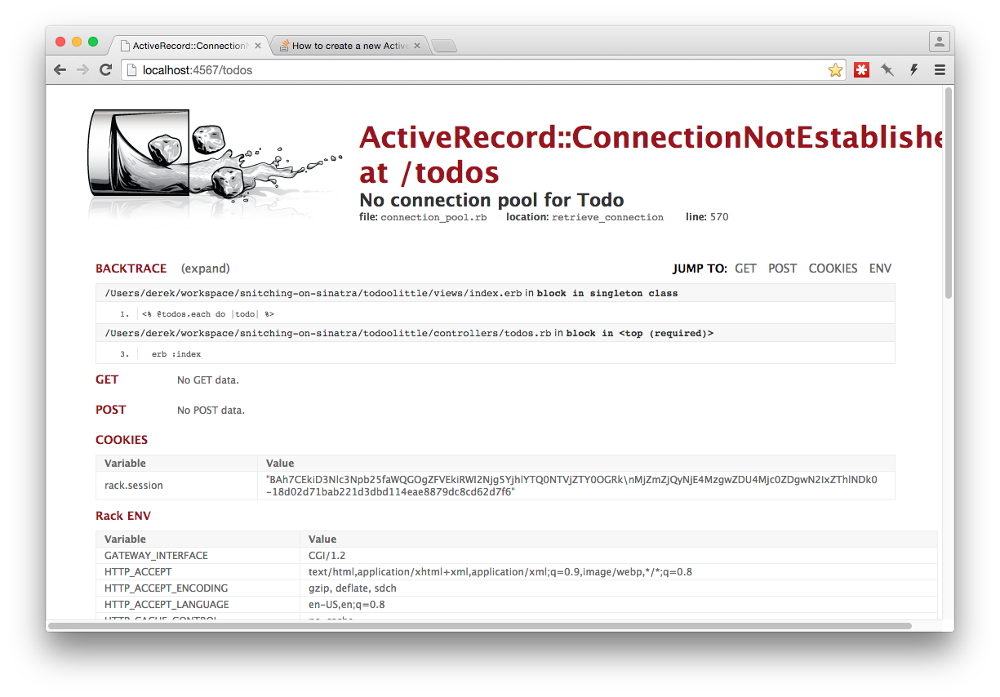
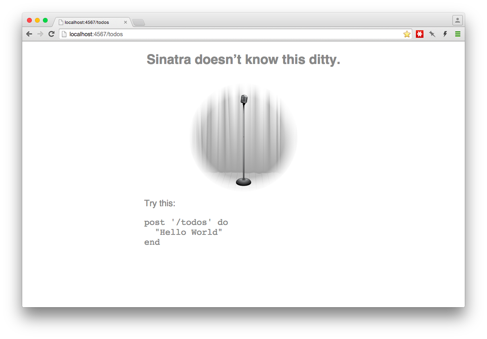
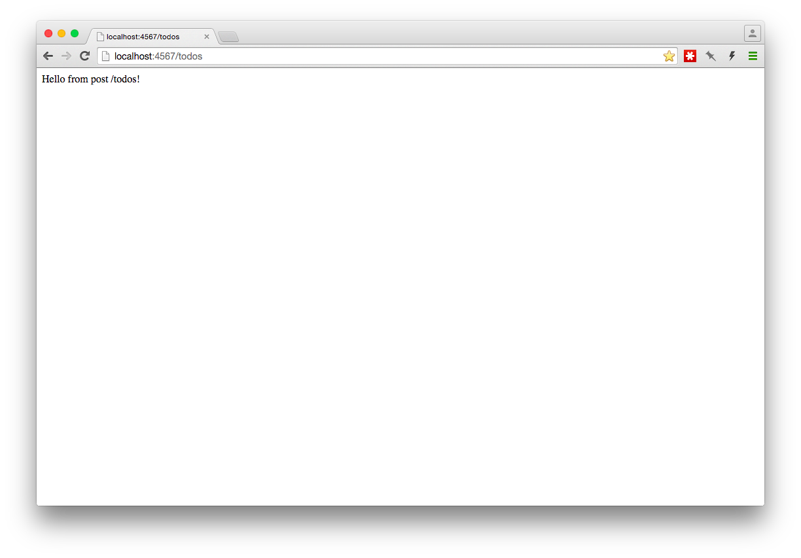

# Snitching on Sinatra Part 2

# Recap
In [part 1](part1.md), we created a simple web application with Sinatra that allowed us to
submit a greeting that would be displayed via HTML in the browser. On the way,
we figured out how to make routes, the differences between different HTTP methods
(GET and POST), and how to render HTML using views. Plus, we got to see at a few 
error states on the way.

# In this installment...
In Part 2 of this tutorial, we're going to build a Sinatra application that 
uses Active Record to store todo items using a SQLite database.

*I know, it's another todo app.*

## Prerequisites
Part 2 of this tutorial assumes some familiarity with:
* The basics of Sinatra. Part 1 of this tutorial may help.
* The basics of Active Record <a href="http://guides.rubyonrails.org/active_record_basics.html" target="_blank">Active Record</a>,
  including:
  * Migrations
  * Classes/Models
  * Accessing the database

Ensure that the required gems have been installed by running

```bash
gem install sqlite3 rerun sinatra activerecord
```

# Starting Out
Create a directory so all of your project files stay together. Let's call it 
`todoolittle`, just so we can refer to a consistent directory name.

```bash
mkdir todoolittle
```

Create a file in that directory called `todoolittle.rb` and `require` the 
gems we've installed: 

```ruby
require 'sinatra'
require 'active_record'
```

At this point, all we've done is require Sinatra, but I recommend trying to 
start your application by running `rerun todoolittle.rb` to make sure you see
what you expect. For example, I expect to see a message in my terminal that says 
a web server is accepting connections on port `4567`.

# Create the Controller 
Create a directory inside the `todoolittle` directory called `controllers`

```bash
mkdir controllers
```

and create a new file called `todos.rb` (in the `controllers` directory)
with the following route:

```ruby
get '/todos' do
  "Welcome to todoolittle!"
end
```

If you visited <a href="http://localhost:4567/todos" target="_blank">http://localhost:4567/todos</a>
in your browser, you'd see Sinatra's 404 page. In part one, we only had one ruby
source file, so when we ran it, it automatically loaded the routes defined in
that source file. We put our routes in a different file, though, so we'll have 
to load those routes.

Since Sinatra is a ruby DSL, we can use ruby syntax to load Sinatra routes. Use
`require` in your `todoolittle.rb` file to load the file that defines our routes.
I'm going to use `require_relative` for the sake of simplification:

```ruby
require_relative 'controllers/todos'
```

Now if you visit <a href="http://localhost:4567/todos" target="_blank">http://localhost:4567/todos</a>
you should see "Welcome to todoolittle" displayed on the page. Keep in mind that 
the only thing Sinatra is doing here is allowing us to use its DSL (`get '/todos'`
with a block) to create a webpage. Everything else we've set up so far is plain
old Ruby, including the `require_relative` we used to load a specific controller
file. 

# Adding ActiveRecord
<a href="http://guides.rubyonrails.org/active_record_basics.html" target="_blank">Active Record</a>
is an Object-Relational Mapping system, or ORM. What an ORM is is outside the
realm of this tutorial, but if it's confusing, there are quite a few resources
online to learn about what it is.

It's pretty common to see web applications that use directories for specific
kinds of classes. For example, we created a `controllers` directory to house our
controller files, so we should probably create a `models` directory to house our
model (Active Record) files: 

```bash
mkdir models
```

In that directory, let's create a new model file to hold our todo items:

```bash
touch models/todo.rb
```

and add a class to that file:

```ruby
class Todo < ActiveRecord::Base
end
```

Like the controller file, we'll need to manually load the new ruby file we added
so that our ruby application can see it. Edit `todoolittle.rb` again to add 
another `require_relative` (the first few lines of this file are the same):

```ruby
require 'sinatra'
require 'active_record'

require_relative 'controllers/todos'
require_relative 'models/todo'
```

If your application is still running, no errors should have occurred. If an error
has been raised, now is a good time to practice debugging.

## Watch it fail
A good, <a href="https://en.wikipedia.org/wiki/Representational_state_transfer" target="_blank">RESTful</a>
route should imply what the client should receive when a request is made. In our
case, the client is a web browser, and the only route we've implemented so far
is `/todos`. When we make a request to `/todos`, some Todos should appear. So 
let's do that by accessing the `Todo` model in the controller:

```ruby
get '/todos' do
  @todos = Todo.all
  erb :index
end
```

We're selecting all of the Todos from the database (this should set off some 
alarm bells... what database?!) and render a view named `index.erb`. We don't 
have that view file, but now is not a terrible time to run our application to 
see that the error messages we're receiving are what we expect. 


This looks very similar to the error we got in part 1 when we were creating a
new view, and we can fix the error by creating the missing view.
Sinatra will automatically check for views in a `views` directory,
which matches our current directory naming scheme and keeps our project looking
nice:

```bash
mkdir views
touch views/index.erb
```

We want a *list* of todo items to be rendered to the page, so let's loop through
the todo items we selected in the controller and display them:

```ruby
<h1>Things to Do</h1>

<% @todos.each do |todo| %>
  <div>
    <%= todo.description %>
  </div>
<% end %>
```

*Now* when you refresh your browser that is pointing to 
<a href="http://localhost:4567/todos" target="_blank">http://localhost:4567/todos</a>,
an error should show up: 



This goes back to what we alluded to before. We don't even *have* a database. 
We haven't told ActiveRecord how to connect to a database. We haven't created
any tables in the database that doesn't exist. All of those things are true, 
and this error message is telling us as much. 

## Configuring Active Record
We'll need to set up an Active Record connection. To do so, change your 
`todoolittle.rb` file to look like this:


```ruby
require 'sinatra'
require 'active_record'
require 'pathname'

# Identify the root directory for the application
# so that we can later reference files from APP_ROOT
APP_ROOT = Pathname.new(File.expand_path('../../', __FILE__))

# Configure the database
database_config = { :adapter  =>  "sqlite3",
                    :database => "#{APP_ROOT}/db/todoolittle.sqlite3" }

ActiveRecord::Base.establish_connection(database_config)

require_relative 'controllers/todos'
require_relative 'models/todo'
```

Let's take this piece-by-piece. 

```ruby
require 'sinatra'
require 'active_record'
require 'pathname'
```

The first two of these requires should look familiar; they were already in
this file. It loads Sinatra and Active Record. The third `require` loads the 
ruby <a href="http://ruby-doc.org/stdlib-2.1.0/libdoc/pathname/rdoc/Pathname.html" target="_blank">Pathname</a>
library, which we use next:

```ruby
# Identify the root directory for the application
# so that we can later reference files from APP_ROOT
APP_ROOT = Pathname.new(File.expand_path('../../', __FILE__))


# Configure the database
database_config = { :adapter  =>  "sqlite3",
                    :database => "#{APP_ROOT}/db/todoolittle.sqlite3" }
```

This defines `APP_ROOT`, a constant that contains the path of the application
we're building. Then it uses `APP_ROOT` to set up a hash of database information,
which we use next:

```ruby
ActiveRecord::Base.establish_connection(database_config)
```

to <a href="http://apidock.com/rails/ActiveRecord/ConnectionHandling/establish_connection" target="_blank">create a connection</a> 
between Active Record and the database that stores our Todo data. 

Whew. Now let's refresh that page again and see what happens. *Hopefully* we'll
see an error message that will tell us what we need to do next.


Well, that's definitely better than the previous error.  `SQLite3::SQLException: no such table: todos`
tells us exactly what the problem is: The `todos` table doesn't exist.


# Creating The `todos` Table
At this point, you're probably saying "How do I create a table in Sinatra?" 
Remember that Sinatra doesn't have any opinions about your models, only its 
simple DSL syntax (routes and the like). Active Record talks to the database,
**so you'll use Active Record to set up your database using migrations.**

Active Record doesn't *really* care where migrations are stored, but other 
developers will appreciate if we store them in a sensible location. It's a 
common convention to store database-related files in a `db` folder and migrations
in a `migrate` folder, so create those in your `todoolittle` folder:

```bash
mkdir -p db/migrate
```

*If you're wondering, `mkdir -p` will create intermediate directories if they 
don't already exist. That is, if we don't already have a `db` directory, it will
create both `db` and `migrate`.*

*For more information about the options you can send to a command line 
application, use `man application`, where `application` is the application you 
want to know more about. To find out more about `mkdir`, run `man mkdir`.*

Now we can create a ruby file that will act as migration to create our `todos`
table:

```bash
touch db/migrate/01_create_todos.rb
```

*Note: We're just going to use the number 01 in the filename to avoid confusion
with timestamps. In most situations, timestamps work better.*

Edit that file and add the code to create a new table:

```ruby
class CreateTodos < ActiveRecord::Migration
  def change
    create_table :todos do |t|
      t.string :description
    end
  end
end
```

Alright, we have a migration. How do we make an actual table from this migration?
We need to tell ActiveRecord to run this migration and create the table.

## Using the Rakefile
This tutorial provides a `Rakefile` for you to use. It should be in the same
directory as this document and it contains a few useful [rake](https://github.com/ruby/rake) 
tasks. I recommend [reading through](Rakefile) the `Rakefile` to familiarize yourself with 
what has been defined and what each task might do. 

Copy the `Rakefile` into your `todoolittle` directory and run `rake -T` to list
the tasks you can use. You should see this:

```bash
rake db:create   # Create the database todolittle
rake db:drop     # Drop the database todolittle
rake db:migrate  # Migrate the database (options: VERSION=x, VERBOSE=false, SCOPE=blog)
```

## Creating the database
Create the database with

```bash
rake db:create
```

and then run the migration we created a little bit ago with

```bash
rake db:migrate
```

You should see output similar to this:

```bash
== 1 CreateTodos: migrating ===================================================
-- create_table(:todos)
   -> 0.0012s
== 1 CreateTodos: migrated (0.0013s) ==========================================
```

Refresh your browser pointing to 
<a href="http://localhost:4567/todos" target="_blank">http://localhost:4567/todos</a>
and you should see something similar to this:


Ok, so we see the headline, but what about our todos? 

What todos?

# Adding some todo items
We don't have any todo items to view yet, so let's create some. We'll be able to
create todos from the web interface in a bit, but for now, let's just start an
`irb` (interactive ruby) session that lets us do things with ActiveRecord. Many
environments have a "console" rake task (or `rails console` in Ruby on Rails)
that sets this up automatically, but we can just use `irb`'s `-r` flag to 
require our environment:

```bash
irb -r./todoolittle
```

This should give you an `irb` command prompt that you can use to create a few
Todo items. After creating a few, reload your browser and you should start
seeing items show up:


# Interlude: What'd we just do?
As a rough description, we created a website which shows Todo items that are 
stored in a database. 

# Creating todos using a form
In the first tutorial, we used a form to help users easily submit data to the
server. We'll be doing the same here.

Let's allow our users to create a Todo item from the list of Todo items. Since
we want to create a new todo item, the form will have to use the POST HTTP 
method (as in the previous tutorial). 

Since we're going to put the form on the same view as the list of todo items,
we can edit `views/index.erb` to include an HTML form. We're creating something 
so the form would use the POST route:

```ruby
<h1>Things to Do</h1>

<% @todos.each do |todo| %>
  <div>
    <%= todo.description %>
  </div>
<% end %>

<form action="/todos" method="post">
  <input type="text" name="description">
  <input type="submit">
</form>
```

If you'll remember from the previous tutorial, the `action` of the form is the
route we'd like the data to be submitted to. The `method` is the HTTP method
we want to be used.

I find the best way to find out what will happen with an HTML element is to try
it out in the browser, so refresh the page, then submit the form with a new Todo
in the input box. After the form is submitted, another 404 error should pop up:



But we can see that it's trying to hit a route that matches `post '/todos'`.

Don't we already have a route that looks like `'/todos'`? Here's what
`controllers/todos.rb` looks like right now:

```ruby
get '/todos' do
  @todos = Todo.all
  erb :index
end
```

`get '/todos'` is different than `post '/todos'`. The HTTP method makes it so 
that Sinatra will look for a `post '/todos'` route instead of the `get '/todos'`
route we already have defined. Since we don't have the `post '/todos'` route 
yet, Sinatra shows us a 404 page.

Let's add the POST route to `controllers/todos.rb`. The order of the routes 
doesn't matter in this case (<a href="http://www.sinatrarb.com/intro.html#Routes" target="_blank">**but is important in other cases**</a>).

```ruby
post '/todos' do
  puts "Hello from POSTS /todos!!"
end
```

Now when we resubmit the form (from 
<a href="http://localhost:4567/todos" target="_blank">http://localhost:4567/todos</a>),
we get a nice message!



We've used the route `/todos` here to make our routes consistent and easy to 
remember. Also notice that we can still hit the
<a href="http://localhost:4567/todos" target="_blank">http://localhost:4567/todos</a>
route, since Sinatra knows there's a difference between a GET and POST route.

But what we'd really like is for a new Todo to be saved in our database with the
description we submitted. We can use ActiveRecord to do that. Update the code of
the `post` route in `controllers/todos.rb` to create a new Todo from the 
parameters sent in by the form and redirect to the list of Todos:

```ruby
post '/todos' do
  Todo.create(description: params[:description])
  redirect '/todos'
end
```

Now when the form is submitted with a new Todo, the new Todo will show up on our
Todo list! Your new Todo item is persisted, even when loading the page or 
restarting your application.

*Note: How does Sinatra know which route to go to when a route responds with a
redirect? It tells the browser to make another request to the route specified
(`'/todos'` in this case), but to make it a GET request. It does this using the
<a href="https://en.wikipedia.org/wiki/HTTP_303" target="_blank">HTTP 303</a> 
status code.*

# Wrap Up
In this version, we created a web application that stores data in a database
that has been submitted using a browser! We tied HTML, Sinatra, ActiveRecord,
and SQLite together to make a web application.
